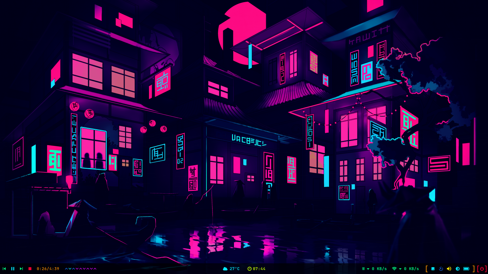
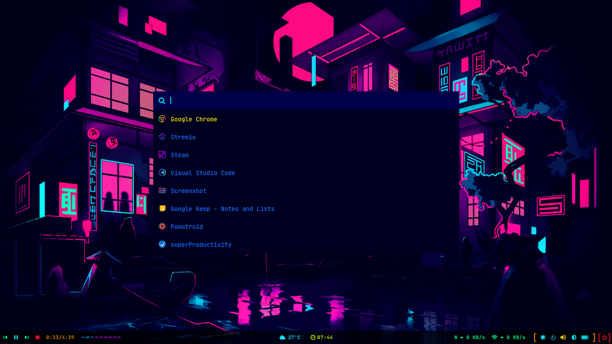
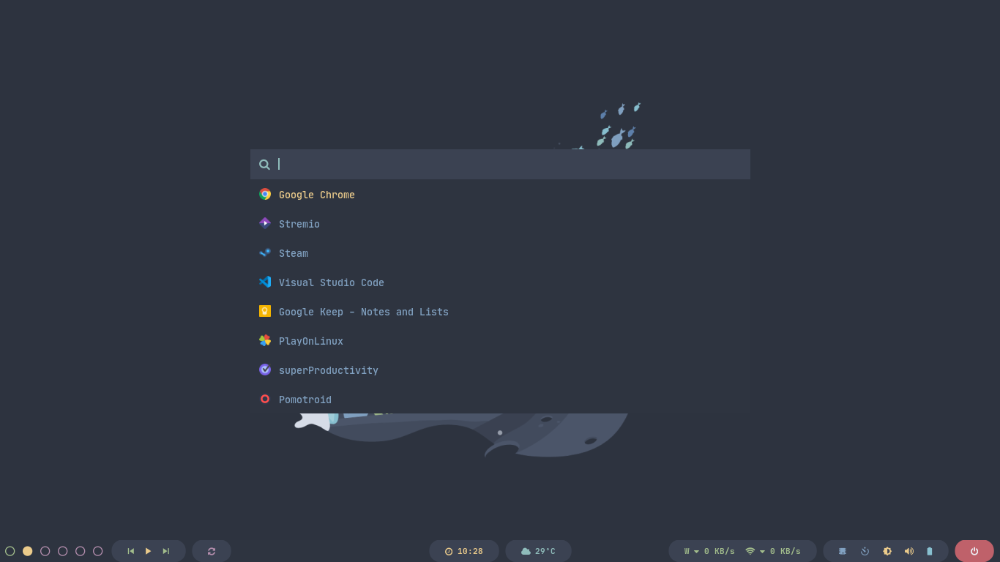
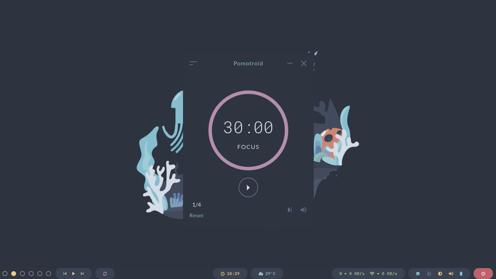

# Polybar Collection

My personal collection.

## Getting Started

Things you need to install first.

### Prerequisites

You need to install Polybar and FontAwesome:

Debian

```bash
sudo apt install polybar fonts-font-awesome
```

Fedora

```bash
sudo dnf install polybar fontawesome-fonts
```

If you're having trouble I highly recommend you to take a look at [polybar repo](https://github.com/polybar/polybar):

### Installing

First you need to download or clone the repo:

```bash
git clone https://github.com/Murzchnvok/polybar-collection
```

Also you'll need to download and install these fonts from [nerd fonts](https://www.nerdfonts.com/font-downloads):

* JetBrainsMono
* Sauce Code Pro

You could copy or move a config folder to *~/.config/* doing this:

```bash
cp -r polybar-collection/material ~/.config/polybar
```

but what I recommend is to use the launch.sh script to launch the config file you want from the polybar-collections folder.

If you're using bspwm you need to add something like this to your bspwmrc:

```bash
$HOME/Projects/fun/polybar-collection/launch.sh
```

If you choose the second option, it will be easier to keep updated and you could always change the theme by just changing the config folder. But for that to work you'll need to put the polybar-collections folder in this directory:

```bash
$HOME/Projects/fun
```

If you want to create and download the polybar-collection:

```bash
mkdir -p $HOME/Projects/fun && cd $HOME/Projects/fun && git clone https://github.com/Murzchnvok/polybar-collection.git
```

## Something you might be interested

* [Rofi Collection](https://github.com/Murzchnvok/rofi-collection)
* [Wallpaper Collection](https://drive.google.com/drive/folders/1o1qjRgkJtnF_8uGB1z6MRsQUjWinHUsw?usp=sharing)
* [Pomotroid (pomodoro app)](https://github.com/Splode/pomotroid)
* [Taskbook (task and notes command line)](https://github.com/klaussinani/taskbook)

*Quality is more important then quantity!*

## Material


## Neon






## Nord





