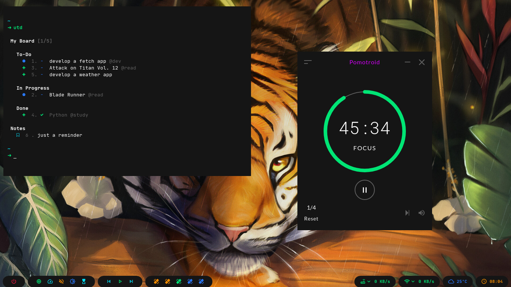

# Polybar Collection

My personal collection.

## Getting Started

Things you need to install first

### Prerequisites

You have to install Polybar and FontAwesome. I'm on Fedora so it's really simple

```bash
sudo dnf install polybar fontawesome-fonts
```

I recommend you to take a look at [polybar repo](https://github.com/polybar/polybar)

### Installing

First you need to download or clone the repo

```bash
git clone https://github.com/Murzchnvok/polybar-collection
```

Also you'll need to download and install these fonts from [nerd fonts](https://www.nerdfonts.com/font-downloads)

* JetBrainsMono
* Sauce Code Pro

You could to copy or move a config folder to *~/.config/* and blablabla doing this:

```bash
cp -r polybar-collections/material ~/.config/polybar
```

but what I recommend is to use the launch.sh script to launch the config file you want from the polybar-collections folder.

If you're using bspwm you need to add something like this to your bspwmrc

```bash
$HOME/polybar-collection/launch.sh
```

If you choose the second option, it will be easier to keep updated and you could always change the theme by just changing the config folder!

## Something you might be interested

* [bspwm dotfiles](https://github.com/Murzchnvok/dotfiles-bspwm)
* [wallpaper collection](https://drive.google.com/drive/folders/1o1qjRgkJtnF_8uGB1z6MRsQUjWinHUsw?usp=sharing)
* [Bind Daily (to get bing daily wallpapers)](https://github.com/Murzchnvok/bing-daily)
* [simple conky theme](https://github.com/Murzchnvok/simple-conky)
* [pomodoro app](https://github.com/Splode/pomotroid)
* [cli task manager](https://github.com/klaussinani/taskbook)

*Quality is more important then quantity*

## Material




I'll add some more in time!
