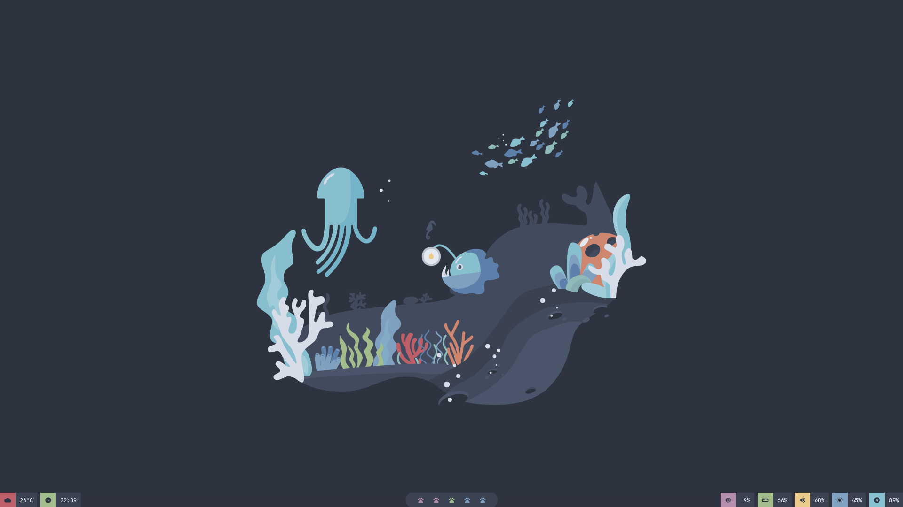
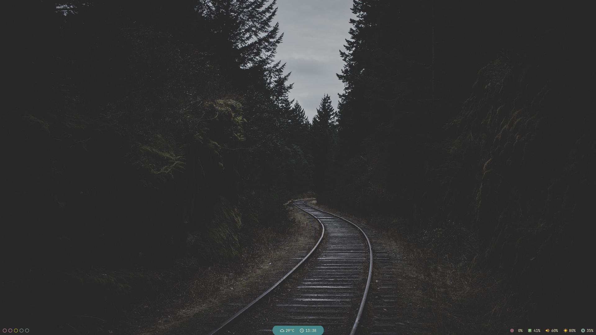

<h2 align="center">Polybar Collection</h2>
<div align="center">
    
</div>

## Getting Started
> I'll add more themes based on what we had before with the new changes.

> Also if you find any typos or I missed something let me know.

### Prerequisites
> You need [polybar](https://github.com/polybar/polybar) installed.

#### Clone repo
> **--depth=1** shallow clone (basically smaller repo size).

```bash
git clone --depth=1 https://github.com/Murzchnvok/polybar-collection
```

#### Use
> You need to set some environment variable, in my case I'll set on `/etc/environment`.

> The only one you actually need is **POLYBAR_COLLECTION** with the path to the **polybar-collection**.

First open the file:
> I use nvim, change to whatever you use.

```bash
sudo nvim /etc/environment
```

Add environment variable:
> The path needs to be where you cloned the **polybar-collection**.

```bash
POLYBAR_COLLECTION=/home/user/polybar-collection
```

Adicional variables are:
> Only needed if you use:
>> battery, wireless and wired modules

- POLYBAR_BATTERY_ADP
- POLYBAR_BATTERY_BAT
- POLYBAR_WIRELESS
- POLYBAR_WIRED

To get battery values:

```bash
ls -1 /sys/class/power_supply/
```

will return your battery adaptar and "name", so it can return:

```bash
ADP0
BAT0
```

`ADP0` goes to **POLYBAR_BATTERY_ADP** and `BAT0` goes to **POLYBAR_BATTERY_BAT**.

To get network values:

```bash
ip addr
```

will return something like this:

```bash
1: lo: ...

2: wlp1s0: ...

3: enp3s0f4u1: ...
```

`wlp1s0` goes to **POLYBAR_WIRELESS** and `enp3s0f4u1` goes to **POLYBAR_WIRED**.

BSPWM
> You probably already know this, but I feel like I need to add the instruction.

Inside **.config/bspwm/bspwmrc** add the line.

```bash
$POLYBAR_COLLECTION/launch.sh &
```

### Customization

#### Change theme and/or colorscheme

Open `config.ini`, there's a comment for both colorscheme and theme.

In the line below **; Colorscheme** you can change the **file.ini** to whatever colorscheme is in the folder **colorscheme/**.

```bash
include-file = ${env:POLYBAR_COLLECTION}/colorscheme/file.ini
```

The same goes to the theme, just change the name after **themes/** to whatever theme you have in the folder **themes/**.

#### Change font
> By default is using **JetBrainsmono** font from [nerd fonts](https://www.nerdfonts.com/font-downloads).

> I left a few comments like **icons normal size**, meaning this font is only used for icons, or **text normal** meaning.. I know you already understood.

Open `fonts.ini`, and change the fonts to whatever you like.

### You might be interested
> I had to update this thing, it was a mess, sometimes I wanted to use another theme but with my beloved gruvbox and I couldn't without changing a lot.

> Other repos related to polybar themes.

- [polybar-themes](https://github.com/adi1090x/polybar-themes) by adi1090x
- [polybar-themes](https://github.com/prcxzm/polybar-themes) by prcxzm
- [Polybar-Collection](https://github.com/Z-8Bit/Polybar-Collection) by Z-8Bit

### Examples
> Change goes in `config.ini` and `enabled-modules.ini`

#### Hidrot


> config.ini

```bash
; Colorscheme
include-file = ${env:POLYBAR_COLLECTION}/colorscheme/nord.ini

; Theme
include-directory = ${env:POLYBAR_COLLECTION}/themes/hidrot

[bar/main]
background = ${colors.semi-trans}
```

> enabled-modules.ini
```bash
modules-left = weather margin date
modules-center = border-round-left bspwm border-round-right
modules-right = cpu margin memory margin pulseaudio margin backlight margin battery
```

#### Murz


> config.ini

```bash
; Colorscheme
include-file = ${env:POLYBAR_COLLECTION}/colorscheme/gruvbox.ini

; Theme
include-directory = ${env:POLYBAR_COLLECTION}/themes/murz

[bar/main]
background = ${colors.full-trans}
```

> enabled-modules.ini
```bash
modules-left = bspwm
modules-center = border-round-left-blue weather date border-round-right-blue
modules-right = cpu memory pulseaudio backlight battery
```
