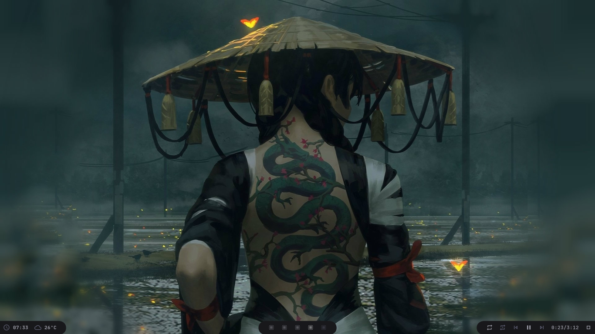

# Polybar Collection

My personal collection. Trying to make some nice themes, and show how great [Polybar](https://github.com/polybar/polybar) is. I'll keep updating the collection, and maybe create some custom scripts so you and I can have a better experience with this thing. I also recommend you to check this [adi1090x Polybar Collection](https://github.com/adi1090x/polybar-themes), has some great themes, so if you don't like my collection, you can just check the other one. Also the reason why I'm doing this is because I want you to have more options and ideas to build your own theme.

Currently trying a few things, if you find something wrong or have any idea just open an issue or send a message on my discord/reddit.

## Getting Started

### Prerequisites

You need to install Polybar, NerdFonts and MaterialIcons:

[Compiling Polybar](https://github.com/polybar/polybar/wiki/Compiling)

You need to download and install these fonts from [NerdFonts](https://www.nerdfonts.com/font-downloads):

- JetBrainsMono
- Iosevka
- UbuntuMono

Also you'll need to install [MaterialIcons](https://github.com/google/material-design-icons).
You have the option to clone the [MaterialIcons](https://github.com/google/material-design-icons) repo, or to move the local **MaterialIcons** to **$HOME/.fonts/** and running:

```bash
$HOME
-> fc-cache -fv
```

### Cloning

First you need to clone the repo in the \$HOME directory:

```bash
$HOME
-> git clone https://github.com/Murzchnvok/polybar-collection
```

or clone to other directory and create a symlink of the folder in the \$HOME directory:

```bash
$HOME/Projects
-> git clone https://github.com/Murzchnvok/polybar-collection

$HOME
-> ln -s $HOME/Projects/polybar-collection $HOME/polybar-collection
```

### Running

BSPwm

```bash
$HOME/polybar-collection/launch.sh
```

I3wm

```bash
exec_always --no-startup-id $HOME/polybar-collection/launch.sh
```

Remember to keep updated:

```bash
$HOME
-> cd $HOME/polybar-collection && git pull
```

## Few changes

Now we only have one file **modules.ini** to change the modules that we like to use. I believe that's a better way to configure our Polybar themes:

```ini
modules-left = date wallz nft tor weather bspwm i3
modules-center = mpd
modules-right = wired cpu memory xbacklight pulseaudio
```

The only problem with this, is that some themes don't have certain modules, for now at least! I'm planning on making this collection easier to setup, so if you have any ideas you can always share.

## Weather app

As pointed out by Dennis Perrone, my personal OpenWeather API Key is in the project as a constant, and I did this intentionally so it just works, and it's fine if you want to use it the same as me, but I'll suggest you to create your own API Key for free in the official [OpenWeather](https://openweathermap.org/api) website. There's a limit of requests you can make using the same API Key, so we both could be without the weather info if a lot of requests are made.

After you create your API Key, you can pass as an argument in the **weather.sh** script, or you can set an environment variable for **OPENWEATHER_API_KEY** with your own API Key:

## Wallz

Still thinking about this one, maybe I should add more 'backend' options, for now is only using Bing API, but I could add more options since Bing API have a 'limited', but with a really good quality, wallpapers collection. For now I'll be only using on minimal theme, but when I'm 'done' I'll add to the others.

## You might be interested

- [Rofi Collection](https://github.com/Murzchnvok/rofi-collection)
- [Wallpaper Collection](https://drive.google.com/drive/folders/1o1qjRgkJtnF_8uGB1z6MRsQUjWinHUsw?usp=sharing)
- [Pomotroid (pomodoro app)](https://github.com/Splode/pomotroid)
- [Ugly To-Do](https://github.com/Murzchnvok/ugly-todo)

_Enjoy!_

### Murz



```ini
modules-left = date weather round-right margin round-left memory cpu xbacklight pulseaudio round-right
modules-center = round-left bspwm i3 round-right
modules-right = round-left wired round-right margin round-left mpd
```

### Chnvok


```ini
modules-left = date weather mpd
modules-center = bspwm
modules-right = memory cpu xbacklight pulseaudio session
```

### Dracula


```ini
modules-left = date margin weather margin mpd
modules-center = bspwm i3
modules-right = memory margin cpu margin xbacklight margin pulseaudio margin battery margin session
```

### Gruvbox


```ini
modules-left = bspwm i3
modules-center = round-left-blue weather date round-right-blue margin round-left mpd round-right
modules-right = memory cpu pulseaudio xbacklight battery session
```

### Material


```ini
modules-left = weather tri-upper-right tri-lower-left-orange date tri-upper-right tri-lower-left-green mpd honey-right
modules-center = trap-left bspwm trap-right
modules-right = lego-left-green memory trap-right lego-left-cyan cpu trap-right lego-left-yellow xbacklight trap-right lego-left-orange pulseaudio trap-right lego-left-cyan battery
```

### Minimal


```ini
modules-left = date wallz nft tor weather bspwm i3
modules-center = mpd
modules-right = wired wlan cpu memory xbacklight pulseaudio
```

### Nord


```ini
modules-left = weather trap-left-orange margin trap-right-green date margin mpd round-right
modules-center = trap-left bspwm i3 trap-right
modules-right = memory margin cpu margin xbacklight margin pulseaudio margin battery trap-right trap-right-orange session trap-left-orange
```

## Based on the themes from the official website

### Blue


```ini
modules-left = margin bspwm i3
modules-center = date
modules-right = pulseaudio dnd wlan margin
```

### White


```ini
modules-left = margin bspwm i3
modules-center = mpd
modules-right = date margin sep margin session margin
```
