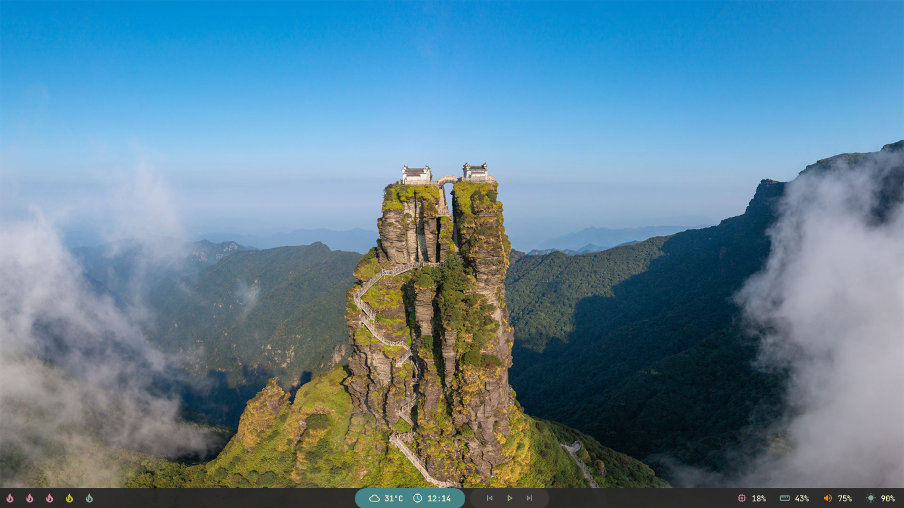

# Polybar Collection

My personal collection. Trying to make some nice themes, and show how great [Polybar](https://github.com/polybar/polybar) is. I'll keep updating the collection, and maybe create some custom scripts so you and I can have a better experience with this thing. I also recommend you to check this [adi1090x Polybar Collection](https://github.com/adi1090x/polybar-themes), has some great themes, so if you don't like my collection, you can just check the other one. Also the reason why I'm doing this is because I want you to have more options and ideas to build your own theme.

Currently trying a few things, if you find something wrong or have any idea just open an issue or send a message on my discord/reddit.

## Getting Started

### Prerequisites

You need to install Polybar, NerdFonts and MaterialIcons:

[Compiling Polybar](https://github.com/polybar/polybar/wiki/Compiling)

You need to download and install these fonts from [NerdFonts](https://www.nerdfonts.com/font-downloads):

- JetBrainsMono
- Iosevka
- UbuntuMono

Also you'll need to install [MaterialIcons](https://github.com/google/material-design-icons).

### Cloning

First you need to clone the repo in the \$HOME directory:

```bash
$HOME
-> git clone https://github.com/Murzchnvok/polybar-collection
```

or clone to other directory and create a symlink of the folder in the \$HOME directory:

```bash
$HOME/Projects
-> git clone https://github.com/Murzchnvok/polybar-collection

$HOME
-> ln -s $HOME/Projects/polybar-collection $HOME/polybar-collection
```

Other option is to copy a config folder to _\$HOME/.config/polybar/_ directory:

```bash
$HOME
-> cp -r material $HOME/.config/polybar
```

or create a symlink of the folder in the _\$HOME/.config/polybar/_ directory:

```bash
$HOME
-> ln -s $HOME/Projects/polybar-collection/themes/nord $HOME/.config/polybar/
```

### Running

BSPwm

```bash
$HOME/polybar-collection/launch.sh
```

I3wm

```bash
exec_always --no-startup-id $HOME/polybar-collection/launch.sh
```

Remember to keep updated:

```bash
$HOME
-> cd $HOME/polybar-collection && git pull
```

## Weather app

As pointed out by Dennis Perrone, my personal OpenWeather API Key is in the project as a constant, and I did this intentionally so it just works, and it's fine if you want to use it the same as me, but I'll suggest you to create your own API Key for free in the official [OpenWeather](https://openweathermap.org/api) website. There's a limit of requests you can make using the same API Key, so we both could be without the weather info if a lot of requests are made.

After you create your API Key, you can pass as an argument in the _weather.sh_ script, or you can set an environment variable for OPENWEATHER_API_KEY with your own API Key:

## You might be interested

- [Rofi Collection](https://github.com/Murzchnvok/rofi-collection)
- [Wallpaper Collection](https://drive.google.com/drive/folders/1o1qjRgkJtnF_8uGB1z6MRsQUjWinHUsw?usp=sharing)
- [Pomotroid (pomodoro app)](https://github.com/Splode/pomotroid)
- [Ugly To-Do](https://github.com/Murzchnvok/ugly-todo)

_Enjoy!_

### Murz


### Chnvok


### Dracula


### Gruvbox



### Material


### Minimal


### Nord


## Based on the themes from the official website

### Blue


### White


