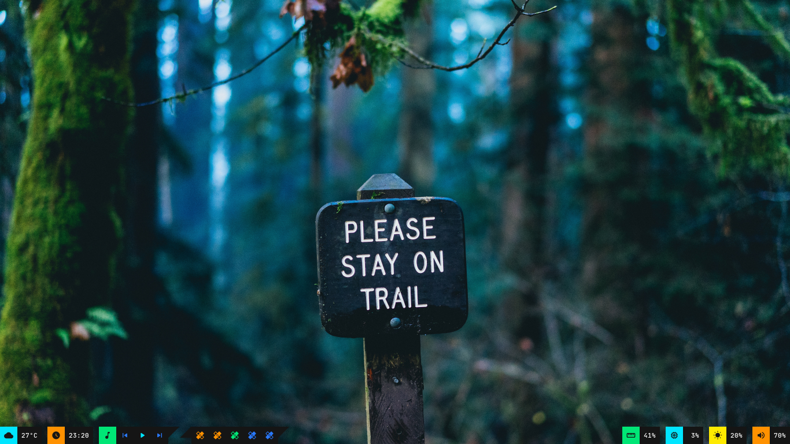

# Polybar Collection

My personal collection.

_If you find any error or you think I need to add something to this readme please send a message to me on [reddit](https://www.reddit.com/user/murzchnvok)_

## Getting Started

### Prerequisites

You need to install Polybar and FontAwesome:

Debian

```bash
$HOME
-> sudo apt install polybar fonts-font-awesome
```

Ubuntu

```bash
$HOME
-> sudo apt install build-essential git cmake cmake-data pkg-config python3-sphinx libcairo2-dev libxcb1-dev libxcb-util0-dev libxcb-randr0-dev libxcb-composite0-dev python3-xcbgen xcb-proto libxcb-image0-dev libxcb-ewmh-dev libxcb-icccm4-dev libxcb-xkb-dev libxcb-xrm-dev libxcb-cursor-dev libasound2-dev libpulse-dev libjsoncpp-dev libmpdclient-dev libcurl4-openssl-dev libnl-genl-3-dev fonts-font-awesome

$HOME
-> git clone --recursive https://github.com/polybar/polybar && cd polybar && mkdir build && cd build && cmake .. && make -j$(nproc) && sudo make install
```

Fedora

```bash
$HOME
-> sudo dnf install polybar fontawesome-fonts
```

If you're having trouble I highly recommend you to take a look at [polybar repo](https://github.com/polybar/polybar).

Also you need to download and install these fonts from [nerd fonts](https://www.nerdfonts.com/font-downloads):

- JetBrainsMono
- Iosevka

To install this font, copy/move to the folder _~/.fonts_ and run in the terminal:

```bash
$HOME
-> fc-cache -fv
```

### Installing

First you need to clone the repo in the \$HOME directory:

```bash
$HOME
-> git clone https://github.com/Murzchnvok/polybar-collection
```

or clone to other directory and create a symlink of the folder in the \$HOME directory:

```bash
$HOME/Projects
-> git clone https://github.com/Murzchnvok/polybar-collection

$HOME
-> ln -s $HOME/Projects/polybar-collection $HOME/polybar-collection
```

Other option is to copy a config folder to _\$HOME/.config/polybar/_ directory:

```bash
$HOME
-> cp -r material $HOME/.config/polybar
```

or create a symlink of the folder in the _\$HOME/.config/polybar/_ directory:

```bash
$HOME
-> ln -s $HOME/Projects/polybar-collection/nord $HOME/.config/polybar/
```

If you're using bspwm you need to add something like this to your bspwmrc:

```bash
$HOME/polybar-collection/launch.sh
```

Remember to keep updated:

```bash
$HOME
-> cd $HOME/polybar-collection && git pull
```

## You might be interested

- [Rofi Collection](https://github.com/Murzchnvok/rofi-collection)
- [Wallpaper Collection](https://drive.google.com/drive/folders/1o1qjRgkJtnF_8uGB1z6MRsQUjWinHUsw?usp=sharing)
- [Pomotroid (pomodoro app)](https://github.com/Splode/pomotroid)
- [Taskbook (task and notes command line)](https://github.com/klaussinani/taskbook)

_Quality is more important then quantity!_

## Dracula


## Material




## Minimal


## Neon


## Nord


